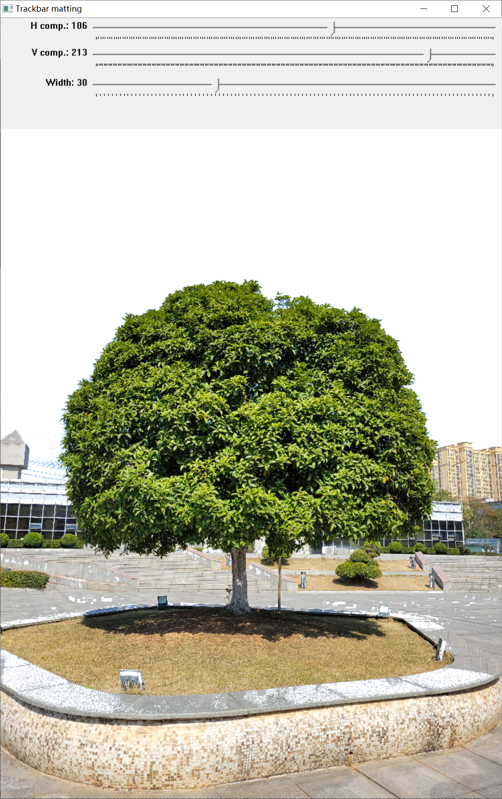

 <h1> 
 Interactive image matting system 
 </h1>

   

 <b>In order to more conveniently separate the trees in the image from the background, we have developed a convenient and efficient image matting software.</b>
 <h2> Quick control</h2>
 We provide 7 keys to quickly manipulate the software.The description is as follows:
 
| Keys  | descriptions |
| ------------- | ------------- |
| 'space'  | segment sky background  |
| 'c' | sketch silhouette  |
| 'e' | edit silhouette |
| 'b' | sketch background |
| '-' | undo the sketch |
| 'r'| reset the image |
| 's'| save the result |
<!-- | 'q'| load the next image(Only used when version is folder)|
| '!'| exit the software | -->

