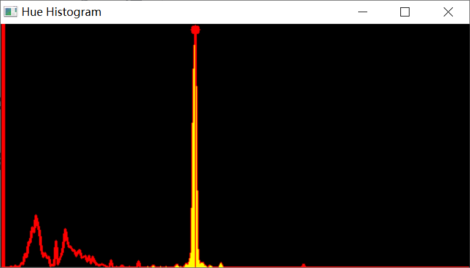
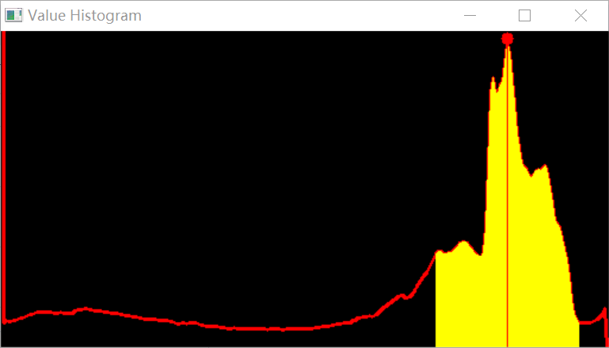

 <h1> 
 Interactive image matting system 
 </h1>

   

 

        

 In order to more conveniently separate the trees in the image from the background, we have developed a convenient and efficient image matting system.
