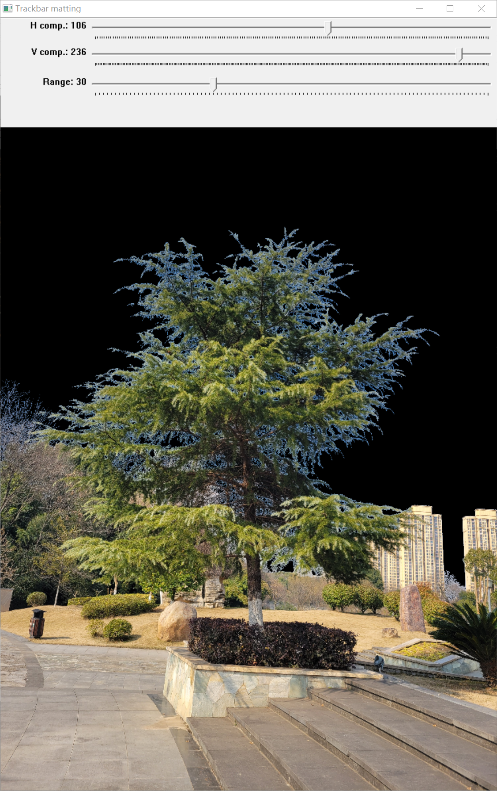
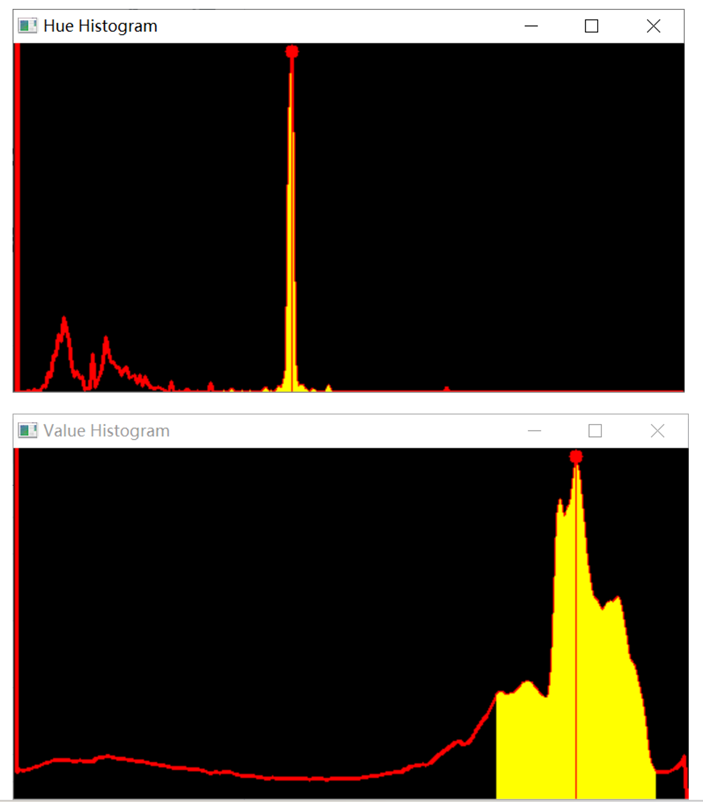

 <h1> <center> Interactive image matting software </center> </h1>

  <br>
 <b>In order to more conveniently separate the trees in the image from the background, we have developed a convenient image matting software.</b>

 <h2> Software Requirements </h2>
 
- Windows System
- MinGW
- opencv

 <h2> Quick control</h2>
 We provide 7 keys to quickly manipulate the software.The description is as follows:
 
| Keys  | descriptions |
| ------------- | ------------- |
| 'space'  | segment sky background  |
| 'c' | sketch silhouette  |
| 'e' | edit silhouette |
| 'b' | sketch background |
| '-' | undo the sketch |
| 'r'| reset the image |
| 's'| save the result |
<!-- | 'q'| load the next image(Only used when version is folder)|
| '!'| exit the software | -->

<h2>How to use it </h2>

### Demonstration video


https://github.com/liuning1234/Inetractivematting/assets/47420641/e0c5f4f0-a4a6-4808-b1f8-e5d82a6765b0

### Using steps
#### Cloning the Repository

```shell
# SSH                                                                       
git clone git@//github.com/NUCIE315/Inetractivematting.git
```
or
```shell
# HTTPS
git clone https://github.com/NUCIE315/Inetractivematting.git
```
#### Operation steps
- <b>step1</b>  Click the InteractiveMatting.exe.
- <b>step2</b>  Input the image path in the cmd.
- <b>step3</b>  Adjust the slider to select the best filter value to remove the background.
- <b>step4</b>  Press the 'space' to segment sky background.
- <b>step5</b>  Press 'c' to sketch silhouette.
- <b>step6</b>  Hold down the left mouse button to draw the contours of tree.
- <b>step7</b>  If necessary, press 'e' to edit silhouette.
- <b>step8</b>  Click and move green points to make it closer to the contours of the trees.
- <b>step9</b>  If necessary, press 'b' to sketch background.
- <b>step10</b>  Hold down the left mouse button to fill blank backgrounde. Press '-' to undo the sketch.
- <b>step11</b>  If necessary, press 'r' to reset the image.
- <b>step12</b>  Press 's' to save the result.

<h2>Possible issues</h2>

- #### Unable to locate program input point in XXX dynamic link library **.dll
  Copy the */MinGW/mingw64/bin/libstdc++-6.dll to C:/Windows/System32.

<h2> Tree reconstruction demo</h2>

### Demo video


https://github.com/NUCIE315/Inetractivematting/assets/47420641/0e058dbc-0031-4363-8117-9315a4a23206


### Volumetric Recontruction of Tree Point Clouds


https://github.com/NUCIE315/Inetractivematting/assets/47420641/18426375-043b-413a-a64d-f4e6296cd08b

### Tree Modeling from Point Clouds


Uploading kk_20240529_17002671_20240529_17012501.mp4…


<h2> Acknowledgments </h2>

<h2> BibTex </h2>
